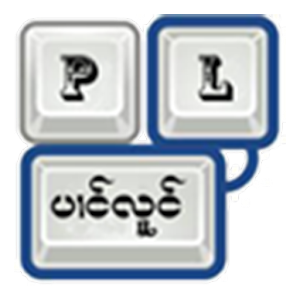
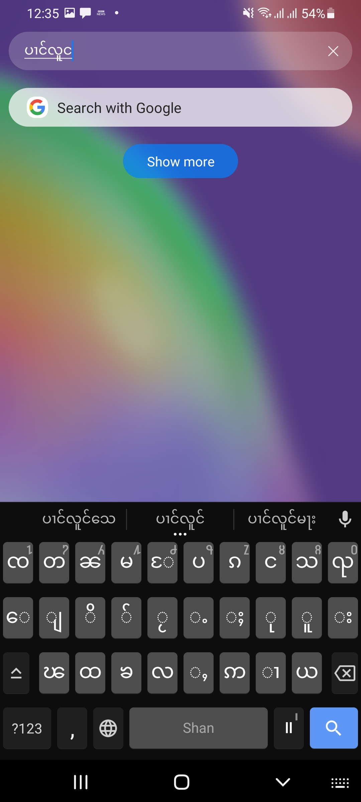

<div id="top"></div>

<!-- PROJECT LOGO -->
<br />

<div align="center">

<table>
  <tr>
    <td>
     
    </td>
    <td>
      
    </td>
  </tr>
</table>

  <h3 align="center">Panglong Keyboard (လွၵ်းမိုဝ်းပၢင်လူင်) - တွၼ်ႈတႃႇ Android</h3>

</div>

<!-- TABLE OF CONTENTS -->

<details>
  <summary>Table of Contents</summary>
  <ol>
    <li>
      <a href="#about-the-project">လွင်ႈတၢင်း</a>
    </li>
    <li><a href="#aosp">AOSP - LatinIME</a></li>
    <li><a href="#openboard">Openboard</a></li>
    <li><a href="#projectlink">Project Link</a></li>
    <li><a href="#roadmap">Roadmap</a></li>
    <li><a href="#contributing">Contributing</a></li>
    <li><a href="#license">License</a></li>
    <li><a href="#contact">ၵပ်းသိုပ်ႇ</a></li>
  </ol>
</details>

<!-- ABOUT THE PROJECT -->

## About The Project

<div align="center">
  <figure>
    
    <br />
    <figcaption>ၸႂ်ႉတိုဝ်းလွၵ်းမိုဝ်းပၢင်လူင် ၼိူဝ် Android</figcaption>
  </figure>
</div>
<br />

Keyboard app ၼိူဝ် Android ဢမ်ႇၸၢင်ႈသႂ်ႇပဵၼ် single-standalone မိူၼ်ၼိူဝ် iOS။ Keyboard app ဢၼ်ႁဵတ်းဝႆႉတႃႇ android တေသႂ်ႇမႃးပႃးလၢႆ" ၽႃႇသႃႇ။

မိူၼ်ၼင်ႇ [Google-Gboard](https://play.google.com/store/apps/details?id=com.google.android.inputmethod.latin), [Microsoft-Swift Key](https://play.google.com/store/apps/details?id=com.touchtype.swiftkey) ၶဝ်ၸိူဝ်းၼႆႉသႂ်ႇမႃးပႃးလိၵ်ႈတႆးယဝ်ႉ ၵူၺ်းႁၢင်ႈၽၢင်လွၵ်းမိုဝ်းဢမ်ႇမိုတ်ႈတႃ
Gboard တႄႉငၢႆး" လွၵ်းမိုဝ်းပၢင်လူင်ယူႇ။

<div align="center">
 <table>
  <tr>
    <td>
      <image src="google_Gboard.jpeg" width="200">
    </td>
    &nbsp; &nbsp; &nbsp; &nbsp; &nbsp; &nbsp; &nbsp; 
    <td>
      <image src="microsoft_Swiftkey.jpeg" width="200">
    </td>
  </tr>
  <tr>
    <td>
      Google-Gboard လွၵ်းမိုဝ်းတႆး
    </td>
    &nbsp; &nbsp; &nbsp; &nbsp; &nbsp; &nbsp; &nbsp; 
    <td>
      Microsoft-Swift-Key လွၵ်းမိုဝ်းတႆး
    </td>
  </tr>
</table> 
</div>

ၶဝ်သွင်ၸဝ်ႈၼႆႉ (Google Gboard and Microsoft Swift-Key) ဢမ်ႇၸႂ်ႈ open-source မီၶူဝ်ႊသၼႃး (ads) လႄႈၵၢၼ်ၵဵပ်းၶေႃႈမုၼ်းၽူႈၸႂ်ႉတိုဝ်း။

ယိူင်းဢၢၼ်းတႃႇ project ၼႆႉတႄႈၵေႃႈ တႃႇလဵပ်ႈႁဵၼ်းလႄႈတႃႇ tai-developer ဢၼ်သူၼ်ၸႂ်ၶႂ်ႈလဵပ်ႈႁဵၼ်း ဢမ်ႇၼၼ်သိုပ်ႇၶူင်သၢင်ႁႂ်ႈၶႅမ်ႉလႅပ်ႈၵႂႃႇတၢင်းၼႃႈၼၼ်ႉ လႆႈပိုၼ်ၽႄႈဝႆႉပၼ်ၶႃႈ။

<p align="right">(<a href="#top">back to top</a>)</p>

<!-- AOSP -->

## AOSP - LatinIME

AOSP - inputmethod/LatinIME ပဵၼ် open-source project ၶွင် android, ပႃးလူၺ်ႈၶိူင်ႈမိုဝ်း၊ starter တွၼ်ႈတႃႇၶူင်သၢင်ႈလွၵ်းမိုဝ်းတွၼ်ႈတႃႇ android။

မိူဝ်ႈတိုၵ်ႉတႅမ်ႈ project ၼႆႉ AOSP ယင်းဢမ်ႇပႆႇ support [three-letter ISO 639-2 codes](https://en.wikipedia.org/wiki/List_of_ISO_639-2_codes) တွၼ်ႈတႃႈလိၵ်ႈတႆး မၢႆ [ISO639-2 standard id 399](https://www.loc.gov/standards/iso639-2/php/langcodes_name.php?code_ID=399) three-letter code ပဵၼ် "shn".

တွၼ်ႈၼႆႉ ၶႃႈဢဝ် [Patch ဢၼ်ႁဵတ်းဝႆႉ](https://github.com/NoerNova/openboard-AOSP_shan-layout-patched) ၼႆႉသေသူင်ႇၶိုၼ်ႈၼိူဝ် [AOSP - android-review.googlesource.com](https://android-review.googlesource.com/c/platform/packages/inputmethods/LatinIME/+/2046273) ဝႆႉၶႃႈ။

AOSP Patch: [https://github.com/NoerNova/openboard-AOSP_shan-layout-patched](https://github.com/NoerNova/openboard-AOSP_shan-layout-patched)

AOSP Dictionary Tool: [https://github.com/NoerNova/aosp-dictionary-tools](https://github.com/NoerNova/aosp-dictionary-tools)

<p align="right">(<a href="#top">back to top</a>)</p>

<!-- Openboard -->

## Openboard

Openboard ပဵၼ် Android Keyboard app ဢဵၼ်ၶူင်သၢင်ႈၸွမ်း AOSP သေပိုတ်ႇပၼ် Open-Source ဝႆႉၶႃႈ။

လူဝ်သေ open-source ယဝ်ႉ openboard ယင်းဢိင်ၼိူဝ် privacy friendly သေပိုၼ်ၽႄႈ app ၶဝ်ဝႆႉၼိူဝ် [Playstore](https://play.google.com/store/apps/details?id=org.dslul.openboard.inputmethod.latin&pcampaignid=pcampaignidMKT-Other-global-all-co-prtnr-py-PartBadge-Mar2515-1).

တွၼ်ႈၼႆႉၶႃႈလႆႈ Fork project သေသႂ်ႇ patch တွၼ်ႈတႃႇလိၵ်ႈတႆး ပဵၼ် patch ဢၼ်လဵဝ်ၵၼ်တင်း AOSP ၶႃႈ။
<br/>
<figure align="center">
  
  <figcaption>AOSP  - Patch for support Shan language</figcaption>
</figure>
<br/>
သေမေး SCRIPT_SHAN ၶဝ်ႈၵႂႃႇၼႂ်း

``` app/src/main/java/org/dslul/openboard/inputmethod/latin/utils/ScriptUtils.java ```

```java
  case SCRIPT_MYANMAR:
  case SCRIPT_SHAN:
      // Myanmar has three unicode blocks :
      // Myanmar U+1000..U+109F
      // Myanmar extended-A U+AA60..U+AA7F
      // Myanmar extended-B U+A9E0..U+A9FF
      return (codePoint >= 0x1000 && codePoint <= 0x109F
              || codePoint >= 0xAA60 && codePoint <= 0xAA7F
              || codePoint >= 0xA9E0 && codePoint <= 0xA9FF);
```

<figure align="center">
  <figcaption>app/src/main/java/org/dslul/openboard/inputmethod/latin/utils/ScriptUtils.java</figcaption>
</figure>

*Unicode တႆးယူႇပႃႈတႂ်ႈလွၵ်း Myanmar-Unicode block ၼႆလႄႈ တီႈၼႆႈၶဝ်ႈပႃးလိၵ်ႈတႆးတၢင်းမူတ်းယဝ်ႉ*

<p align="right">(<a href="#top">back to top</a>)</p>

<!-- PROJECTLINK -->

## Project Link

### Openboard
- Openboard (Original): [https://github.com/openboard-team/openboard](https://github.com/openboard-team/openboard)
- Openboard (Patch လိၵ်ႈတႆး): [https://github.com/NoerNova/openboard](https://github.com/NoerNova/openboard)

### AOSP
- AOSP (Original): [https://android.googlesource.com/platform/packages/inputmethods/LatinIME/](https://android.googlesource.com/platform/packages/inputmethods/LatinIME/)
- AOSP (Patch လိၵ်ႈတႆး): [https://github.com/NoerNova/openboard-AOSP_shan-layout-patched](https://github.com/NoerNova/openboard-AOSP_shan-layout-patched)
- AOSP Dictionary tool (Original): [https://github.com/remi0s/aosp-dictionary-tools](https://github.com/remi0s/aosp-dictionary-tools)
- AOSP Dictionary Tool (Patch လိၵ်ႈတႆး): [https://github.com/NoerNova/aosp-dictionary-tools](https://github.com/NoerNova/aosp-dictionary-tools)

### Dictionary tools
- Fasttext (Original): [https://fasttext.cc/](https://fasttext.cc/docs/en/unsupervised-tutorial.html#getting-the-data) - တွၼ်ႈတႃႇၸၼ်ၶေႃႈမုၼ်းတီႈ shnwiki မႃးႁဵတ်းၶေႃႈမုၼ်း

<p align="right">(<a href="#top">back to top</a>)</p>

<!-- ROADMAP -->

## Roadmap

- [x] Android - [https://github.com/NoerNova/openboard](https://github.com/NoerNova/openboard)
  - [x] With auto correct dictionary.
  - [ ] Improved dictionary with more and more data.

See the [open issues](https://github.com/NoerNova/Panglong_Keyboards/issues) for a full list of proposed features (and known issues).

<p align="right">(<a href="#top">back to top</a>)</p>

<!-- CONTRIBUTING -->

## Contributing

Contributions are what make the open source community such an amazing place to learn, inspire, and create. Any contributions you make are **greatly appreciated**.

If you have a suggestion that would make this better, please fork the repo and create a pull request. You can also simply open an issue with the tag "enhancement".
Don't forget to give the project a star ⭐️ ! Thanks again!

Pull: [https://github.com/NoerNova/openboard/pulls](https://github.com/NoerNova/openboard/pulls)

<p align="right">(<a href="#top">back to top</a>)</p>

<!-- LICENSE -->

## License

Apache 2.0.

<p align="right">(<a href="#top">back to top</a>)</p>

<!-- CONTACT -->

## ၵပ်းသိုပ်ႇ

NorHsangPha - [noernova.com](noernova.com) - noernova666@gmail.com

Project Link: [https://github.com/NoerNova/Panglong_Keyboards](https://github.com/NoerNova/Panglong_Keyboards)

<p align="right">(<a href="#top">back to top</a>)</p>
