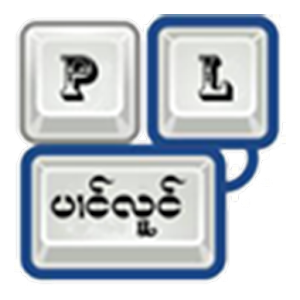

<div id="top"></div>

<!-- PROJECT LOGO -->
<br />

<div align="center">

<table>
  <tr>
    <td>
     
    </td>
    <td>
      
    </td>
  </tr>
</table>

  <h3 align="center">AOSP Dictionary tools</h3>

</div>

<!-- TABLE OF CONTENTS -->

<details>
  <summary>Table of Contents</summary>
  <ol>
    <li>
      <a href="#about-the-project">လွင်ႈတၢင်း</a>
    </li>
    <li><a href="#aosp-dictionary-tools">AOSP Dictionary tools</a></li>
    <li><a href="#shan-wiki">Shan Wiki</a></li>
    <li><a href="#fasttext">Fasttext</a></li>
    <li><a href="#create-dict">Create Dict</a></li>
    <li><a href="#project-link">Project Link</a></li>
    <li><a href="#roadmap">Roadmap</a></li>
    <li><a href="#contributing">Contributing</a></li>
    <li><a href="#license">License</a></li>
    <li><a href="#ၵပ်းသိုပ်ႇ">ၵပ်းသိုပ်ႇ</a></li>
  </ol>
</details>

<!-- ABOUT THE PROJECT -->

## About The Project

<div align="center">
  <figure>
    
    <br />
    <figcaption>Auto correct dictionary</figcaption>
  </figure>
</div>
<br />

[AOSP (Android Open-Source Project) LatinIME](https://android.googlesource.com/platform/packages/inputmethods/LatinIME/) ၸၢင်ႈသႂ်ႇပႃး dictionary တွၼ်ႈတႃႇ auto correcttion လၢမ်းၶၢတ်ႈၶေႃႈၵႂၢမ်းမိူၼ် ဢၼ်တေဢၢၼ်းဢၢင်ႈပေႃႉၸိူဝ်းၼၼ်ႉ။

<p align="right">(<a href="#top">back to top</a>)</p>

<!-- AOSPDICTIONARYTOOLS -->

## AOSP Dictionary tools

တွၼ်ႈတႃႇတေႁဵတ်း Dictionary files ၼၼ်ႉၸႂ်ႉ [aosp-dictionary-tools](https://github.com/remi0s/aosp-dictionary-tools) သေႁဵတ်းၾၢႆႇ .dict ဢွၵ်ႇမႃး

**syntax** တူဝ်ယၢင်ႇဢၼ် aosp-dictionary-tools ၸႂ်ႉဝႆႉ

```js
dictionary=main:en,locale=en,description=Sample wordlist,date=1351495318,version=1
 word=sample,f=200
  bigram=wordlist,f=243
 word=wordlist,f=180
 word=shortcut,f=176
  shortcut=target,f=10
 word=witelisted,f=10,not_a_word=true
  shortcut=whitelisted,f=whitelist
 word=profanity,f=0
 ```

 ```xml
 word=ဝၼ်း, f=113794
 word=မိူဝ်ႈပီ, f=15475
 word=ပီ, f=9794
 word=ၽိုၼ်ဢိင်, f=8929
 word=ပိူင်ထၢၼ်ႈ, f=7872
 word=သေ, f=6643
 word=ယဝ်ႉ, f=6365 
 word=ၼႆႉ, f=5972
 word=ၵေႃႉ, f=5323
 word=ပဵၼ်, f=4666
 word=လႄႈ, f=4595
 word=ၸႄႈတွၼ်ႈ, f=4150
 word=တီႈ, f=3951
 word=ၸႄႈဝဵင်း, f=3798
 ...
```

**တွၼ်ႈၼႆႉ လူဝ်ႇၶေႃႈမုၼ်း၊ ထွႆႈၵႂၢမ်း၊ ပွင်ႈၵႂၢမ်းတင်းၼမ်** မႃးၼိူင်းတူၺ်းဝႃႈ ၶေႃႈၵႂၢမ်းလႂ်မီးၼမ်ႈၼၵ်း frequency word (ပွင်ႇဝႃႈၵႆႉၸႂ်ႉဝႆႉၼႂ်းပွင်ႈၵႂၢမ်း) သေပၼ်ဝႆႉမၢႆၼပ်ႉၼမ်ႉၼၵ်း frequency မၼ်း။

တေၸၢင်ႈပဵၼ်တွၼ်ႈဢၼ်ၶဝ်ႈတိၼ်ၶဝ်ႈမိုဝ်းႁႅင်း"တွၼ်ႈၼိုင်ႈ ပေႃးတေမႃးသူၺ်းၼပ်ႉမိုဝ်းတႄႉတေဢမ်ႇၸၢင်ႈယဝ်ႉ။

<p align="right">(<a href="#top">back to top</a>)</p>


<!-- WIKI -->
## Shan Wiki
ဢဝ်ၵုင်ႇမုၼ်ၽူႈၶတ်းႁႅင်းၶူင်သၢင်ႈ [ဝီႇၶီႇၽီးတီးယႃး https://shn.wikipedia.org/wiki/Shan](https://shn.wikipedia.org/wiki/Shan) ဢၼ်လႆႈၶူင်သၢင်ႈ တႅမ်ႈတၢင်ႇ ႁဵတ်းဝႆႉပၼ် ဝီႇၶီႇၽီးတီးယႃး ၽႃႇသႃႇတႆး။

ၶေႃႈမုၼ်း၊ ထွႆႈၵႂၢမ်း၊ ပွင်ႈၵႂၢမ်း တွၼ်ႈတႃႇလိၵ်ႈတႆးမီးဝႆႉၼိူဝ်ဝီႇၶီႇၽီးတီးယႃး တင်းၼမ် ၸၢင်ႈပဵင်းပေႃးတႃႇဢဝ်မႃးႁဵတ်း dictionary ၼႂ်းတွၼ်ႈၼႆႉယဝ်ႉ။

***တွၼ်ႈတႃႇၶေႃႈမုၼ်းလိၵ်ႈတႆး ၸၼ်ဢဝ်လႆႈတီႈ***

Link: [https://dumps.wikimedia.org/shnwiki/latest/shnwiki-latest-pages-articles.xml.bz2](https://dumps.wikimedia.org/shnwiki/latest/shnwiki-latest-pages-articles.xml.bz2)

<p align="right">(<a href="#top">back to top</a>)</p>

<!-- FASTTEXT -->

## Fasttext
Fasttext ပဵၼ် tools library ၶူင်သၢင်ႈလူၺ်ႈ Meta (Facebook) တွၼ်ႈတႃႇၸႂ်ႉတိုဝ်းလဵပ်ႈႁဵၼ်း word representations and sentence classification. ပွတ်းတွၼ်ႈၵၢၼ်ဢၼ်ၼိုင်ႈၼႂ်း NLP.

တွၼ်ႈၼႆႉတႄႉဢမ်ႇလႆႈၸႂ်ႉ fasttext လိုၵ်ႉ" ၸၼ်ဢဝ် program ၸိုဝ်ႈ ```wikifil.pl``` မႃးၸႂ်ႉႁဵတ်းလွင်ႈမူတ်းသႂ်ၶေႃႈမုၼ်း wiki ဢဝ်ပႅတ်ႈ tag တၢင်းမူတ်းဢၼ်ဢမ်ႇၸႂ်ႈတူဝ်မႄႈလိၵ်ႈတႆးၼၼ်ႉ

[```wikifil.py``` original ](https://github.com/facebookresearch/fastText/blob/main/wikifil.pl)တႅမ်ႈမႃးတွၼ်ႈတႃႇၽႃႇသႃႇ english လႄႈၽႃႇသႃႇဢၼ်ႁပ်ႉ ascii code ၵူၺ်း၊ တႃႇလိၵ်ႈတႆး ႁဝ်းလႆႈ[ထႅမ် rules ထႅင်ႈသွင်သၢမ်ထႅဝ်](https://github.com/NoerNova/aosp-dictionary-tools/blob/main/wikifil.pl)

Link: [wikifil.py original](https://github.com/facebookresearch/fastText/blob/main/wikifil.pl)

Link: [wikifil.py added rules](https://github.com/NoerNova/aosp-dictionary-tools/blob/main/wikifil.pl)


<p align="right">(<a href="#top">back to top</a>)</p>

<!-- CREATE DICT -->

## Create Dict
### ၶၵ်ႉတွၼ်ႈၵၢၼ်ၸႂ်ႉ aosp-dictionary-tools
1. သႂ်ႇၸုဝ်ႈ file ၶေႃႈမုၼ်းဢၼ် clean ယဝ်ႉတူဝ်ႈၼႂ်း ```sort.sh``` သေၸႂ်ႉ
   ```sh
   ./sort.sh
   ```
2. တေလႆႈ file ဢၼ်ၼိုင်ႈဢွၵ်ႇမႃးၸိုဝ်ႈၸွမ်းပဵၼ် .combined သေၸႂ်ႉ
   ```sh
    perl parser.pl filename > newfilename
   ```
3. file မႂ်ႇဢၼ်လႆႈမႃးၼၼ်ႉ ထႅမ်သႂ်ႁူဝ်မႂ်းပဵၼ်
   ```sh
   'dictionary=main:shn,locale=shn,description=Shan dict created from wikishn by NoerNova,date=1648756002,version=1'

   # shn, local=shn - မၢႆ code shan
   # date: - ဝၼ်းထီႉ run "date +%s" ၼႂ်း terminal
   ```

   တူဝ်ယၢင်ႇ

    ```sh
      dictionary=main:shn,locale=shn,description=Shan dict created from shnwiki by NoerNova,date=1648486460,version=1
        word=ဝၼ်း, f=254
        word=မိူဝ်ႈပီ, f=254
        word=ပီ, f=254
        word=ၽိုၼ်ဢိင်, f=254
        word=ပိူင်ထၢၼ်ႈ, f=254
        word=သေ, f=254
        word=ယဝ်ႉ, f=254 
        word=ၼႆႉ, f=254
        word=ၵေႃႉ, f=254
    ```

4.  သႂ်ႇၸုဝ်ႈ file ၶေႃႈမုၼ်းဢၼ် clean ယဝ်ႉတူဝ်ႈၼႂ်း ```run.sh``` သေၸႂ်ႉ
   
    ```sh
    ./run.sh
    ```
5. တေလႆႈ file main_shn.dict မႃး ဢဝ်ၵႂႃႇသႂ်ႇၼႂ်း ```res/raw``` ([openboard](https://github.com/NoerNova/openboard)) သေၶိုၼ်း build မႂ်ႇ။
   

<p align="right">(<a href="#top">back to top</a>)</p>

<!-- PROJECT LINK -->

## Project Link

### aosp-dictionary-tools
- aosp-dictionary-tools: [https://github.com/NoerNova/aosp-dictionary-tools](https://github.com/NoerNova/aosp-dictionary-tools)

<p align="right">(<a href="#top">back to top</a>)</p>

<!-- ROADMAP -->

## Roadmap

- [x] main_shn.dict
- [ ] train more data.

See the [open issues](https://github.com/NoerNova/Panglong_Keyboards/issues) for a full list of proposed features (and known issues).

<p align="right">(<a href="#top">back to top</a>)</p>

<!-- CONTRIBUTING -->

## Contributing

Contributions are what make the open source community such an amazing place to learn, inspire, and create. Any contributions you make are **greatly appreciated**.

If you have a suggestion that would make this better, please fork the repo and create a pull request. You can also simply open an issue with the tag "enhancement".
Don't forget to give the project a star ⭐️ ! Thanks again!

Pull: [https://github.com/NoerNova/aosp-dictionary-tools/issues](https://github.com/NoerNova/aosp-dictionary-tools/issues)

<p align="right">(<a href="#top">back to top</a>)</p>

<!-- LICENSE -->

## License

Apache 2.0.

<p align="right">(<a href="#top">back to top</a>)</p>

<!-- CONTACT -->

## ၵပ်းသိုပ်ႇ

NorHsangPha - [noernova.com](noernova.com) - noernova666@gmail.com

Project Link: [https://github.com/NoerNova/Panglong_Keyboards](https://github.com/NoerNova/Panglong_Keyboards)

<p align="right">(<a href="#top">back to top</a>)</p>
