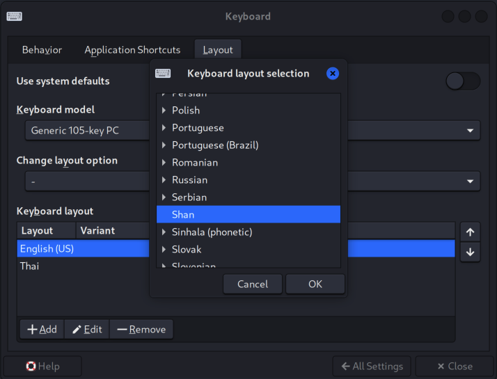

<div id="top"></div>

<!-- PROJECT LOGO -->
<br />

<div align="center">

<table>
  <tr>
    <td>
     
    </td>
    <td>
      \          
    </td>
  </tr>
</table>

  <h3 align="center">Panglong Keyboard (လွၵ်းမိုဝ်းပၢင်လူင်) - တွၼ်ႈတႃႇ Linux</h3>

</div>

<!-- TABLE OF CONTENTS -->

<details>
  <summary>Table of Contents</summary>
  <ol>
    <li>
      <a href="#about-the-project">လွင်ႈတၢင်း</a>
    </li>
    <li><a href="#debian-standard-keyboard">Debian Standard Keyboard</a></li>
    <li><a href="#shan-x11-xkb-symbols">Shan X11 xkb symbols/</a></li>
    <li><a href="#roadmap">Roadmap</a></li>
    <li><a href="#contributing">Contributing</a></li>
    <li><a href="#license">License</a></li>
    <li><a href="#ၵပ်းသိုပ်ႇ">ၵပ်းသိုပ်ႇ</a></li>
  </ol>
</details>

<!-- ABOUT THE PROJECT -->

## About The Project

<div align="center">
  <figure>
    
    <br />
    <figcaption>ၸႂ်ႉတိုဝ်းလွၵ်းမိုဝ်းပၢင်လူင် ၼိူဝ် Linux</figcaption>
  </figure>
</div>
<br />

တႃႇတေၸႂ်ႉတိုဝ်းလိၵ်ႈတႆးၼႂ်း Linux (Ubuntu, Debian) ဢၼ်မီးဝႆႉတေၵႆႉ" ႁၼ်ၸိူဝ်း [iBus, Keyman (Keymagic)](https://askubuntu.com/a/269801) ၶဝ်ၸိူဝ်းၼႆႉပဵၼ် Program, App ဢၼ်ၼိုင်ဢၼ်တေလႆႈ Install လူင်းၼႂ်းၶိူင်ႈ ၸဵမ်ဢဝ် dependency ယွႆႈယႅမ်းတင်းၸိူဝ်း။

ၸိူဝ်းၼႆႉဢမ်ႇမိူၼ် Native keyboard (feel like native) ဢၼ်ပႃးမႃးၼႂ်း Linux။

ယိူင်းဢၢၼ်းတႃႇ project ၼႆႉတႄႈၵေႃႈ တႃႇလဵပ်ႈႁဵၼ်းလႄႈတႃႇ tai-developer ဢၼ်သူၼ်ၸႂ်ၶႂ်ႈလဵပ်ႈႁဵၼ်း ဢမ်ႇၼၼ်သိုပ်ႇၶူင်သၢင်ႁႂ်ႈၶႅမ်ႉလႅပ်ႈၵႂႃႇတၢင်းၼႃႈၼၼ်ႉ လႆႈပိုၼ်ၽႄႈဝႆႉပၼ်ၶႃႈ။

<p align="right">(<a href="#top">back to top</a>)</p>

<!-- DEBIAN STANDARD KEYBOARD -->

## Debian Standard Keyboard

Debian Linux X11 ပိုၼ်ၽႄႈ standard keyboard ၶဝ်ဝႆႉဝႃႈ
```
The standard location of the keyboard file is /etc/default/keyboard. Description of all available keyboard models, layouts, variants and options is available in /usr/share/X11/xkb/rules/xorg.lst. In most cases, in /usr/share/keymaps/ or /usr/share/syscons/keymaps/ you will find several keymaps that can be used with the variable KMAP.
```
Link: https://manpages.debian.org/testing/keyboard-configuration/keyboard.5.en.html#FILES

<p align="right">(<a href="#top">back to top</a>)</p>

<!-- SHAN X11 XKB SYMBOLS -->

## Shan X11 xkb symbols

တီႈၼႆႈၼႆႉ ႁဝ်းတႅမ်ႈ [shn xkb symbo rules](https://github.com/NoerNova/Shan-keyboard-X11-linux/blob/master/sh) တွၼ်ႈတႃႇ layout တႆးသေသႂ်ႇဝႆႉတီႈ ```/usr/share/X11/xkb.symbols/```

တူဝ်ယၢင်ႇ rules: https://github.com/NoerNova/Shan-keyboard-X11-linux/blob/master/sh

သေယဝ်ႉ တႅမ်ႈ Shan rules list layout
```xml
# Shan's rules
<layout>
    <configItem>
        <name>sh</name>
        <shortDescription>sh</shortDescription>
        <description>Shan</description>
        <languageList>
            <iso639Id>shn</iso639Id>
        </languageList>
    </configItem>
</layout>"
```
သႂ်ႇဝႆႉၼႂ်း ```/usr/share/X11/xkb/rules/evdev.xml``` ၵေႃႈၸႂ်ႉလႆႈယဝ်ႉ။

<p align="right">(<a href="#top">back to top</a>)</p>

<!-- PROJECT LINK -->

## Project Link

### Shan-keyboard-X11-linux
- Shan-keyboard-X11-linux: [https://github.com/NoerNova/Shan-keyboard-X11-linux](https://github.com/NoerNova/Shan-keyboard-X11-linux)

<p align="right">(<a href="#top">back to top</a>)</p>

<!-- ROADMAP -->

## Roadmap

- [x] Linux - [https://github.com/NoerNova/Shan-keyboard-X11-linux](https://github.com/NoerNova/Shan-keyboard-X11-linux)
  - [ ] Contribute to Linux package management

See the [open issues](https://github.com/NoerNova/Panglong_Keyboards/issues) for a full list of proposed features (and known issues).

<p align="right">(<a href="#top">back to top</a>)</p>

<!-- CONTRIBUTING -->

## Contributing

Contributions are what make the open source community such an amazing place to learn, inspire, and create. Any contributions you make are **greatly appreciated**.

If you have a suggestion that would make this better, please fork the repo and create a pull request. You can also simply open an issue with the tag "enhancement".
Don't forget to give the project a star ⭐️ ! Thanks again!

Pull: [https://github.com/NoerNova/Shan-keyboard-X11-linux/issues](https://github.com/NoerNova/Shan-keyboard-X11-linux/issues)

<p align="right">(<a href="#top">back to top</a>)</p>

<!-- LICENSE -->

## License

Apache 2.0.

<p align="right">(<a href="#top">back to top</a>)</p>

<!-- CONTACT -->

## ၵပ်းသိုပ်ႇ

NorHsangPha - [noernova.com](noernova.com) - noernova666@gmail.com

Project Link: [https://github.com/NoerNova/Panglong_Keyboards](https://github.com/NoerNova/Panglong_Keyboards)

<p align="right">(<a href="#top">back to top</a>)</p>
