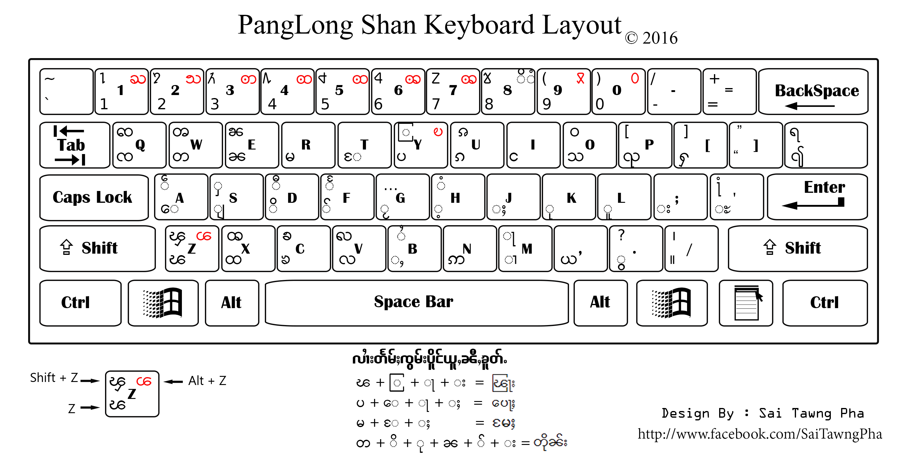

<!-- PROJECT LOGO -->
 

  

  <h3 align="center">Panglong Keyboard (လွၵ်းမိုဝ်း ပၢင်လူင်) - Shan keyboard layout</h3>

<!-- TABLE OF CONTENTS -->

  
Table of Contents

  <ol>
    <li>
      <a href="#about-the-project">About The Project</a>
    </li>
    <li><a href="#roadmap">Roadmap</a></li>
    <li><a href="#project-link">Project Link</a></a></li>
    <li><a href="#contributing">Contributing</a></li>
    <li><a href="#license">License</a></li>
    <li><a href="#ၵပ်းသိုပ်ႇ">ၵပ်းသိုပ်ႇ</a></li>
  </ol>

<!-- ABOUT THE PROJECT -->

## About The Project

  <figure>
     
    <figcaption>Panglong Keyboard by Sai Tawng Pha</figcaption>
  </figure>

 

Project ၶူင်သၢင်ႈ လွၵ်းမိုဝ်းပၢင်လူင် တွၼ်ႈတႃႇလိၵ်ႈတႆး [Shan/Tai language](https://en.wikipedia.org/wiki/Shan_language) လႄႈပိုတ်ႇၽုၺ်ႇသွတ်ႉၶူတ်ႉ (Open-Source) တွၼ်ႈတႃႇ mainstream platform ၵူႇဢၼ်မိူၼ်ၼင်ႇ

ယိူင်းဢၢၼ်းတႃႇ project ၼႆႉတႄႈၵေႃႈ တႃႇလဵပ်ႈႁဵၼ်းလႄႈတႃႇ tai-developer ဢၼ်သူၼ်ၸႂ်ၶႂ်ႈလဵပ်ႈႁဵၼ်း ဢမ်ႇၼၼ်သိုပ်ႇၶူင်သၢင်ႁႂ်ႈၶႅမ်ႉလႅပ်ႈၵႂႃႇတၢင်းၼႃႈၼၼ်ႉ လႆႈပိုၼ်ၽႄႈဝႆႉပၼ်ၶႃႈ။

- [x] Android
- [x] iOS
- [x] Linux
- [x] macOS
- [x] Windows

(<a href="#top">back to top</a>)

<!-- ROADMAP -->

## Roadmap

- [x] Android - [https://github.com/NoerNova/openboard](https://github.com/NoerNova/openboard)
  - [x] With auto correct dictionary.
- [x] iOS - [https://github.com/NoerNova/PanglongKeyboard-iOS](https://github.com/NoerNova/PanglongKeyboard-iOS)
  - [ ] With auto correct dictionary.
- [x] Linux - [https://github.com/NoerNova/Shan-keyboard-X11-linux](https://github.com/NoerNova/Shan-keyboard-X11-linux)
  - [ ] Contribute to Linux package management
- [x] macOS - [https://github.com/NoerNova/Panglong_Shan_Keyboard_macOS](https://github.com/NoerNova/Panglong_Shan_Keyboard_macOS)
- [x] Windows - [https://github.com/NoerNova/Panglong_Shan_Keyboard_Windows](https://github.com/NoerNova/Panglong_Shan_Keyboard_Windows)

See the [open issues](https://github.com/NoerNova/Panglong_Keyboards/issues) for a full list of proposed features (and known issues).

(<a href="#top">back to top</a>)

<!-- PROJECT LINK -->

## Project Link

- Android: [https://github.com/NoerNova/Panglong_Keyboards/tree/main/Android](https://github.com/NoerNova/Panglong_Keyboards/tree/main/Android)
  - AOSP-Dictionary-Tools: [https://github.com/NoerNova/aosp-dictionary-tools](https://github.com/NoerNova/aosp-dictionary-tools)
- iOS: [https://github.com/NoerNova/Panglong_Keyboards/tree/main/iOS](https://github.com/NoerNova/Panglong_Keyboards/tree/main/iOS)
- Linux: [https://github.com/NoerNova/Panglong_Keyboards/tree/main/Linux](https://github.com/NoerNova/Panglong_Keyboards/tree/main/Linux)
- macOS: [https://github.com/NoerNova/Panglong_Keyboards/tree/main/macOS](https://github.com/NoerNova/Panglong_Keyboards/tree/main/macOS)
- Windows: [https://github.com/NoerNova/Panglong_Keyboards/tree/main/Windows](https://github.com/NoerNova/Panglong_Keyboards/tree/main/Windows)

(<a href="#top">back to top</a>)

<!-- CONTRIBUTING -->

## Contributing

Contributions are what make the open source community such an amazing place to learn, inspire, and create. Any contributions you make are **greatly appreciated**.

If you have a suggestion that would make this better, please fork the repo and create a pull request. You can also simply open an issue with the tag "enhancement".
Don't forget to give the project a star ⭐️ ! Thanks again!

1. Android - [https://github.com/NoerNova/openboard/pulls](https://github.com/NoerNova/openboard/pulls)
2. iOS - [https://github.com/NoerNova/PanglongKeyboard-iOS/pulls](https://github.com/NoerNova/PanglongKeyboard-iOS/pulls)
3. Linux - [https://github.com/NoerNova/Shan-keyboard-X11-linux/pulls](https://github.com/NoerNova/Shan-keyboard-X11-linux/pulls)
4. macOS - [https://github.com/NoerNova/Panglong_Shan_Keyboard_macOS/pulls](https://github.com/NoerNova/Panglong_Shan_Keyboard_macOS/pulls)
5. Windows - [https://github.com/NoerNova/Panglong_Shan_Keyboard_win/pulls](https://github.com/NoerNova/Panglong_Shan_Keyboard_win/pulls)

(<a href="#top">back to top</a>)

<!-- LICENSE -->

## License

Apache 2.0.

(<a href="#top">back to top</a>)

<!-- CONTACT -->

## ၵပ်းသိုပ်ႇ

NorHsangPha - [noernova.com](noernova.com) - noernova666@gmail.com

Project Link: [https://github.com/NoerNova/Panglong_Keyboards](https://github.com/NoerNova/Panglong_Keyboards)

(<a href="#top">back to top</a>)

