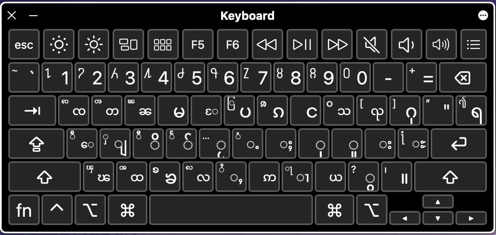

<!-- PROJECT LOGO -->
 

<table>
  <tr>
    <td>
     
    </td>
    <td>
      
    </td>
  </tr>
</table>

  <h3 align="center">Panglong Keyboard (လွၵ်းမိုဝ်းပၢင်လူင်) - တွၼ်ႈတႃႇ Windows</h3>

<!-- TABLE OF CONTENTS -->

  
Table of Contents

  <ol>
    <li>
      <a href="#about-the-project">လွင်ႈတၢင်း</a>
    </li>
    <li><a href="#windows-keyboard-layouts">Windows Keyboard Layouts</a></li>
    <li><a href="#project-link">Project Link</a></li>
    <li><a href="#roadmap">Roadmap</a></li>
    <li><a href="#contributing">Contributing</a></li>
    <li><a href="#license">License</a></li>
    <li><a href="#ၵပ်းသိုပ်ႇ">ၵပ်းသိုပ်ႇ</a></li>
  </ol>

<!-- ABOUT THE PROJECT -->

## About The Project

  <figure>
    
     
    <figcaption>ၸႂ်ႉတိုဝ်းလွၵ်းမိုဝ်းပၢင်လူင် ၼိူဝ် Windows</figcaption>
  </figure>

 

တွၼ်ႈတႃႇၶူင်သၢင်ႈလွၵ်းမုဝ်းပေႃႉလိၵ်ႈၼိူဝ် Windows တႄႉလႆႈဝႃႈငၢႆႈသုတ်းၸႂ်ႉ program [Microsoft Keyboard Layout Creator (MSKLC)](https://www.microsoft.com/en-us/download/details.aspx?id=102134) သေၶူင်သၢင်ႈဢွၵ်ႇ installer file (.exe ဢမ်ႇၼၼ် .msi) ၵူၺ်းၵေႃႉၸႂ်ႉလႆႈယဝ်ႉ။

ယိူင်းဢၢၼ်းတႃႇ project ၼႆႉတႄႈၵေႃႈ တႃႇလဵပ်ႈႁဵၼ်းလႄႈတႃႇ tai-developer ဢၼ်သူၼ်ၸႂ်ၶႂ်ႈလဵပ်ႈႁဵၼ်း ဢမ်ႇၼၼ်သိုပ်ႇၶူင်သၢင်ႁႂ်ႈၶႅမ်ႉလႅပ်ႈၵႂႃႇတၢင်းၼႃႈၼၼ်ႉ လႆႈပိုၼ်ၽႄႈဝႆႉပၼ်ၶႃႈ။

(<a href="#top">back to top</a>)

<!-- WINDOWS KEYBOARD LAYOUTS -->

## Windows Keyboard Layouts

ၶူင်သၢင်ႈ layout လူၺ်ႈ [Microsoft Keyboard Layout Creator (MSKLC)](https://www.microsoft.com/en-us/download/details.aspx?id=102134) သေၶူင်သၢင်ႈဢွၵ်ႇ installer file (.exe ဢမ်ႇၼၼ် .msi) ယဝ်ႉၸိုင် Install လႆႈၵမ်းလဵဝ်။

(<a href="#top">back to top</a>)

<!-- PROJECT LINK -->

## Project Link

### Panglong_Shan_Keyboard_Windows
- Panglong_Shan_Keyboard_Windows: [https://github.com/NoerNova/Panglong_Shan_Keyboard_Windows](https://github.com/NoerNova/Panglong_Shan_Keyboard_Windows)

(<a href="#top">back to top</a>)

<!-- ROADMAP -->

## Roadmap

- [x] Windows - [https://github.com/NoerNova/Panglong_Shan_Keyboard_Windows](https://github.com/NoerNova/Panglong_Shan_Keyboard_Windows)

See the [open issues](https://github.com/NoerNova/Panglong_Keyboards/issues) for a full list of proposed features (and known issues).

(<a href="#top">back to top</a>)

<!-- CONTRIBUTING -->

## Contributing

Contributions are what make the open source community such an amazing place to learn, inspire, and create. Any contributions you make are **greatly appreciated**.

If you have a suggestion that would make this better, please fork the repo and create a pull request. You can also simply open an issue with the tag "enhancement".
Don't forget to give the project a star ⭐️ ! Thanks again!

Pull: [https://github.com/NoerNova/Panglong_Shan_Keyboard_Windows/issues](https://github.com/NoerNova/Panglong_Shan_Keyboard_Windows/issues)

(<a href="#top">back to top</a>)

<!-- LICENSE -->

## License

Apache 2.0.

(<a href="#top">back to top</a>)

<!-- CONTACT -->

## ၵပ်းသိုပ်ႇ

NorHsangPha - [noernova.com](noernova.com) - noernova666@gmail.com

Project Link: [https://github.com/NoerNova/Panglong_Keyboards](https://github.com/NoerNova/Panglong_Keyboards)

(<a href="#top">back to top</a>)

