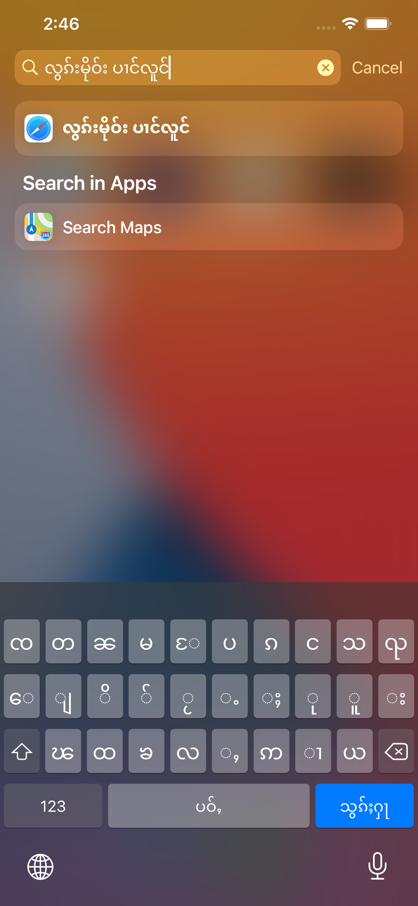
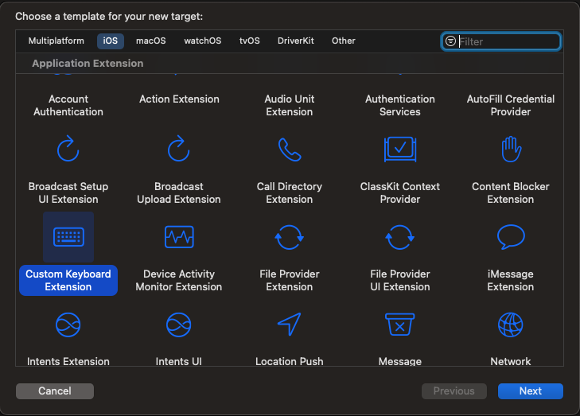
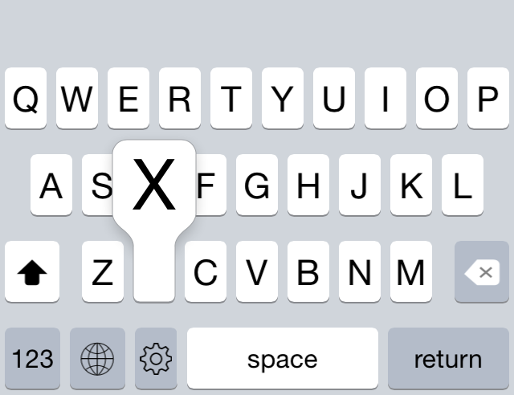

<!-- PROJECT LOGO -->
 

<table>
  <tr>
    <td>
     
    </td>
    <td>
      
    </td>
  </tr>
</table>

  <h3 align="center">Panglong Keyboard (လွၵ်းမိုဝ်းပၢင်လူင်) - တွၼ်ႈတႃႇ iOS</h3>

<!-- TABLE OF CONTENTS -->

  
Table of Contents

  <ol>
    <li>
      <a href="#about-the-project">လွင်ႈတၢင်း</a>
    </li>
    <li><a href="#ios-custom-keyboard">iOS custom keyboard</a></li>
    <li><a href="#archagon---tasty-imitation-keyboard">Archagon - Tasty-imitation-keyboard</a></li>
    <li><a href="#project-link">Project Link</a></li>
    <li><a href="#roadmap">Roadmap</a></li>
    <li><a href="#contributing">Contributing</a></li>
    <li><a href="#license">License</a></li>
    <li><a href="#ၵပ်းသိုပ်ႇ">ၵပ်းသိုပ်ႇ</a></li>
  </ol>

<!-- ABOUT THE PROJECT -->

## About The Project

  <figure>
    
     
    <figcaption>ၸႂ်ႉတိုဝ်းလွၵ်းမိုဝ်းပၢင်လူင် ၼိူဝ် Android</figcaption>
  </figure>

 

Keyboard app ၼိူဝ် iOS ဢၼ်ပႃးမႃး (support) လိၵ်ႈတႆး ဢၼ်ၸႂ်ႉၶႅမ်ႉၼႆႉမီး [TTKeyboard](https://apps.apple.com/us/app/ttkeyboard/id919884616) ဢၼ်လဵဝ်ၵူၺ်း [Google-Gboard](https://play.google.com/store/apps/details?id=com.google.android.inputmethod.latin), [Microsoft-Swift Key](https://play.google.com/store/apps/details?id=com.touchtype.swiftkey) ၵေႃႈယင်းပႆႇသႂ်ႇမႃးပၼ်ပႃးလိၵ်ႈတႆး

 <table>
  <tr>
    <td>
      <image src="ttkeyboard_setting.PNG" width="200">
    </td>
    &nbsp; &nbsp; &nbsp; &nbsp; &nbsp; &nbsp; &nbsp; 
    <td>
      <image src="ttkeyboard_shan.PNG" width="200">
    </td>
  </tr>
  <tr>
    <td>
      Google-Gboard လွၵ်းမိုဝ်းတႆး
    </td>
    &nbsp; &nbsp; &nbsp; &nbsp; &nbsp; &nbsp; &nbsp; 
    <td>
      Microsoft-Swift-Key လွၵ်းမိုဝ်းတႆး
    </td>
  </tr>
</table> 

TTkeyboard version မိူဝ်ႈလဵဝ်း လွၵ်းလၢႆးလႅၵ်ႈပိၼ်ၾႃႇသႃႇဢမ်ႇပႆႇပေႃးမိူၼ် Native (feel like native) ၼႂ်း iOS, language chang button ၼႂ်း iPhoneX ၶိုၼ်ႈၼိူဝ်ပႃးမႃးဝႆႈသွင်ဢၼ်။

ၵွပ်ႈယူႇပႃႈတႂ်ႈၶွမ်ႊပႃႇၼီႇ (Company) သေ ၶဝ်ၵေႃႈ ဢမ်ႇပိုတ်ႇပၼ် open-source မီၶူဝ်ႊသၼႃး (ads) လႄႈၵၢၼ်ၵဵပ်းၶေႃႈမုၼ်းၽူႈၸႂ်ႉတိုဝ်း။

ယိူင်းဢၢၼ်းတႃႇ project ၼႆႉတႄႈၵေႃႈ တႃႇလဵပ်ႈႁဵၼ်းလႄႈတႃႇ tai-developer ဢၼ်သူၼ်ၸႂ်ၶႂ်ႈလဵပ်ႈႁဵၼ်း ဢမ်ႇၼၼ်သိုပ်ႇၶူင်သၢင်ႁႂ်ႈၶႅမ်ႉလႅပ်ႈၵႂႃႇတၢင်းၼႃႈၼၼ်ႉ လႆႈပိုၼ်ၽႄႈဝႆႉပၼ်ၶႃႈ။

(<a href="#top">back to top</a>)

<!-- IOS CUTOM KEYBOARD -->

## iOS custom keyboard

iOS ၼႂ်း xCode ပၼ်မႃးပႃးလွၵ်းလၢႆးတႃႇၶူင်သၢင်ႈ Custom Keyboard သေတႃႇ ၵူၺ်း Layout လႄႈ Animation တေလႆႈတႅမ်ႈဢဝ်ၵူၺ်းတင်းမူတ်း။

<figure align="center">
  
  <figcaption>Xcode  - Add custom keyboard extension</figcaption>
</figure>

#### **Challenge**

 <table>
  <tr>
    <td>
      <image src="demo_testKeyboard.png" width="200">
    </td>
    &nbsp; &nbsp; &nbsp; &nbsp; &nbsp; &nbsp; &nbsp; 
    <td>
      <image src="demo_blankKeyboard.png" width="200">
    </td>
  </tr>
  <tr>
    <td>
      Add custom keyboard - iosKeyboardTest
    </td>
    &nbsp; &nbsp; &nbsp; &nbsp; &nbsp; &nbsp; &nbsp; 
    <td>
      ဢမ်ႇမီး layout သင်မႃးပၼ်
    </td>
  </tr>
</table> 

တေႃႇထိုင်မိူဝ်ႈလဵဝ် (September 2021) Apple ယင်းဢမ်ႇပႆႇပိုတ်ႇပၼ် Keyboard API  ၶဝ်။

(<a href="#top">back to top</a>)

<!-- ARCHAGON -->

## Archagon - Tasty-imitation-keyboard

ၶႃႈလႆႈၶူၼ်ႉႁႃၶေႃႈမုၼ်းတူၺ်းၸွင်ႇယၢမ်ႈမီးၽႂ် custom iOS keyboard သေ ပိုတ်ႇ open-source ဝႆႉ၊ ဢၼ်ၶိုၵ်ႉမၼ်းမီးဝႆႉသွင်သၢမ်ဢၼ်ၵူၺ်းဢမ်ႇမီးဢၼ်လႂ်မိူၼ် Native iOS keyboard သေဢၼ် မိူၼ်ၼင်ႇ၊
- [https://github.com/KeyboardKit/KeyboardKit](https://github.com/KeyboardKit/KeyboardKit) ပဵၼ်ဢၼ်မႂ်ႇ update တီႈသုတ်း ၵူၺ်း animation မၼ်းဢမ်ႇမိူၼ် iOS native
- [https://github.com/archagon/tasty-imitation-keyboard](https://github.com/archagon/tasty-imitation-keyboard) animation မိူၼ် iOS native ၵူၺ်း feature လၢႆ"ဢၼ်ဢမ်ႇပႆႇတဵမ်ထူၼ်ႈ၊ **တႅမ်ႈဝႆႉမိူဝ်ႈ 8 ပီပူၼ်ႉမႃးယဝ်ႉ**။

<figure align="center">
  
  <figcaption>Tasty-imitation-keyboard animation</figcaption>
</figure>

ဢၼ်တူၺ်းလႅပ်ႈယၢပ်ႇ လႄႈတေၸႂ်ႉၶၢဝ်းယၢမ်းႁိုင်ပူၼ်ႉတီႈတွၼ်ႈတႃႇၶႃႈပဵၼ်တွၼ်ႈ Animation မၼ်းၼႆလႄႈ ၶႃႈ clone တွၼ်ႈ keyboard animation တီႈ [tasty-imitation-keyboard](https://github.com/archagon/tasty-imitation-keyboard) သေမႃး သိုပ်ႇႁဵတ်းတေႃႇၵႂႃႇ။

(<a href="#top">back to top</a>)

<!-- PROJECT LINK -->

## Project Link

### Tasty-Imitation-Keyboard
- Openboard (Original): [https://github.com/openboard-team/openboard](https://github.com/openboard-team/openboard)

### PanglongKeyboard-iOS
- PanglongKeyboard-iOS: [https://github.com/NoerNova/PanglongKeyboard-iOS](https://github.com/NoerNova/PanglongKeyboard-iOS)

(<a href="#top">back to top</a>)

<!-- ROADMAP -->

## Roadmap

- [x] iOS - [https://github.com/NoerNova/PanglongKeyboard-iOS](https://github.com/NoerNova/PanglongKeyboard-iOS)
  - [ ] With auto correct dictionary.

See the [open issues](https://github.com/NoerNova/Panglong_Keyboards/issues) for a full list of proposed features (and known issues).

(<a href="#top">back to top</a>)

<!-- CONTRIBUTING -->

## Contributing

Contributions are what make the open source community such an amazing place to learn, inspire, and create. Any contributions you make are **greatly appreciated**.

If you have a suggestion that would make this better, please fork the repo and create a pull request. You can also simply open an issue with the tag "enhancement".
Don't forget to give the project a star ⭐️ ! Thanks again!

Pull: [https://github.com/NoerNova/PanglongKeyboard-iOS/issues](https://github.com/NoerNova/PanglongKeyboard-iOS/issues)

(<a href="#top">back to top</a>)

<!-- LICENSE -->

## License

Apache 2.0.

(<a href="#top">back to top</a>)

<!-- CONTACT -->

## ၵပ်းသိုပ်ႇ

NorHsangPha - [noernova.com](noernova.com) - noernova666@gmail.com

Project Link: [https://github.com/NoerNova/Panglong_Keyboards](https://github.com/NoerNova/Panglong_Keyboards)

(<a href="#top">back to top</a>)

